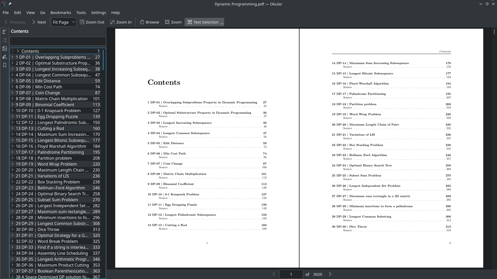

# Geeks for Geeks PDFs



PDF versions of Geeks for Geeks articles. Compiled into book form.

Big shout out to [@gnijuohz](https://github.com/gnijuohz) for his [awesome work](https://github.com/gnijuohz/geeksforgeeks-as-books/).

The only thing I wasn't satisfied with was that the articles in the PDFs were listed in random order, which just felt odd, so I did a bit of manual work by first storing the links in JSON, sorting them by hand, fixing a few title issues and then fine tuning the PDF output generated by customising the pandoc latex template. 

The results are super neat.

Download them on the [releases](https://github.com/dufferzafar/geeks-pdf/releases/) page.

## Running the code

To download all pages belonging to a particular tag, say `samsung`:

```bash
py3.6 list_links.py samsung
py2.7 download_html.py samsung
py3.6 html_to_pdf.py samsung
```
